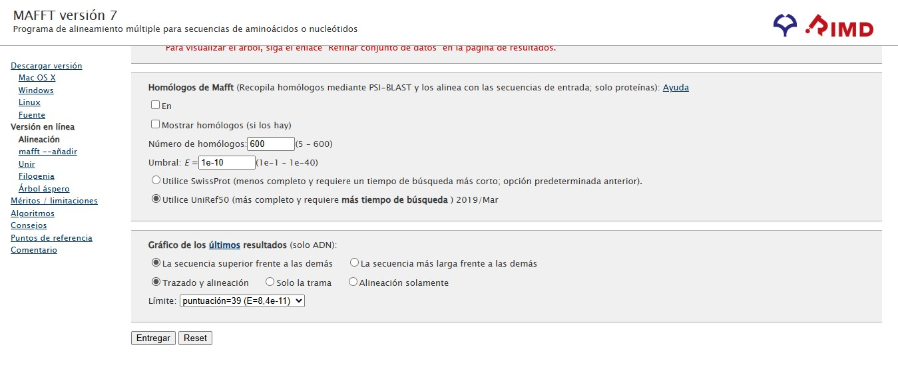

# Caracterización molecular y filogenética de poblacional de la familia *Psychotria* (*Rubiaceae*)

El presente proyecto tuvo como objetivo realizar una caracterización filogenética y poblacional del género *Psychotria* (Familia *Rubiaceae*), mediante el análisis de secuencias del gen cloroplástico rbcL obtenidas de la base de datos GenBank. Se recopilaron más de 20 accesiones representativas de distintas especies del género, priorizando aquellas de distribución tropical. Las secuencias fueron sometidas a control de calidad para eliminar duplicados, secuencias incompletas y regiones ambiguas. Posteriormente, se realizó un alineamiento múltiple utilizando el programa MAFFT, seguido de la estimación de distancias genéticas y la construcción de árboles filogenéticos bajo el método de Máxima Verosimilitud con soporte bootstrap. Adicionalmente, se aplicaron análisis poblacionales básicos y multivariados (PCA y AMOVA) para evaluar la estructura genética entre especies y regiones geográficas. Los resultados evidencian una clara diferenciación entre clados asociados a distintas zonas tropicales, con altos niveles de divergencia intraespecífica en algunos taxones. Esta información sugiere una historia evolutiva influenciada por procesos de aislamiento geográfico y diversificación ecológica. El estudio contribuye a la comprensión filogenética del género Psychotria y resalta la utilidad de los marcadores cloroplásticos como herramientas para evaluar la diversidad genética y la relación evolutiva entre especies tropicales de Rubiaceae.
Para realizar este proyecto se siguió estos pasos:

## 1. Selección y descarga
Se buscó en Genbak  organism[ORGN]="Psychotria" AND rbcL[gene], se seleccionó 26 epsecies asegurandóse que tengan una distribucción tropical y se descargó todas en un sólo archivo en formato FASTA.

## Descarga de las secuencias

##  Anexo A — Archivo único de secuencias de la Familia *Psychotria* sin curar

El archivo FASTA con las secuencias obtenidas de GenBank se encuentra disponible aquí:

[📄 Descargar ANEXO A (FASTA)](ANEXO%20A.fasta)

## 2. Control de calidad y curación
Se verificó la longitud y calidad de las secuencias obtenidas, eliminando aquellas que presentaban ambigüedades, regiones incompletas o fragmentos parciales que pudieran comprometer la precisión del alineamiento. En los casos en que se detectaron secuencias duplicadas, se conservó únicamente una muestra representativa por localidad o espécimen, con el fin de evitar redundancias y mantener la representatividad biogeográfica del conjunto de datos.

## Curación manual de datos en MEGA 11

El archivo FAST con las secuencias obtenidas tras curar manualmente se encuentra disponible aquí:
[📄 Descargar Secuencias Curadas manualmente (FASTA)](Secuencias%20Curadas%20manualmente.fas)

## 3. Alineamiento
Para el alineamiento de las secuencias curadas se utilizará MAFFT, un programa de alineamiento múltiple de secuencias que permite organizar nucleótidos homólogos de manera precisa y eficiente. El archivo FASTA previamente curado en MEGA será ingresado a MAFFT utilizando parámetros automáticos, lo que generará un alineamiento global considerando homología entre todas las secuencias.
## Cargar el archivo Secuencias Curadas manualmente en MAFFT

## Parámetros de entrada y formato para alineamiento de secuencias

Tipo de secuencias (MAYÚSCULAS / minúsculas): Aminoácido → MAYÚSCULAS; Nucleótido → minúsculas

**Nota:** Todas las secuencias de ADN como rbcL se ingresarán en minúsculas, para mantener consistencia y facilitar la lectura de MAFFT.

Dirección de las secuencias de nucleótidos: Ajustar la dirección según la primera secuencia

**Nota:** Esto asegura que todas las secuencias estén orientadas de manera consistente respecto a la primera secuencia, evitando posibles inversiones que afectarían el alineamiento. Es suficientemente preciso para secuencias del mismo marcador.

Orden de salida: Alineado

**Nota:** Las secuencias en el archivo de salida se ordenarán en el mismo orden que el alineamiento, facilitando la visualización y posteriores análisis filogenéticos.

Longitud del título en formato Clustal: 10

**Nota:** Solo se usa la primera palabra de cada título como identificador. Esto permite un formato legible y compatible con programas que leen Clustal, sin truncar información crítica de los IDs de GenBank.

Nombre del trabajo: Alineamiento final

**Nota:** Nombre descriptivo para identificar el archivo de salida, este campo es opcional

## Configuración avanzada
### Configuración automática

- Configuración avanzada: se seleccionó “Automático” porque MAFFT elige la estrategia óptima según el número de secuencias y el tamaño del dataset, equilibrando velocidad y precisión.

### Método de alineamiento

- Método de alineamiento: se eligió "Intenta alinear las regiones con huecos de todos modos” porque algunas secuencias presentan insertos o deleciones largas y se busca mejorar la homología en regiones con huecos.

### Parámetros

- Matriz de puntuación (BLOSUM62 / 200PAM κ=2) se eligió por ser la predeterminada estándar, adecuada para proteínas y ADN divergente respectivamente, asegurando una alineación confiable.

- Penalización por apertura de hueco (1.53): se dejó por defecto para equilibrar la introducción de huecos sin sobre-penalizar regiones con insertos.

- Valor de desplazamiento (0.0): se mantuvo predeterminado para evitar movimientos locales innecesarios que compliquen la alineación.

- Tratamiento de N en nucleótidos (cero): se escogió para que las bases desconocidas no afecten la puntuación de alineación.

Árbol guía (UPGMA):se dejó por defecto, ya que proporciona un orden inicial eficiente para el alineamiento progresivo.
### Homólogos de Mafft

- Homólogos de MAFFT (desactivado) porque solo se requiere alinear las secuencias de entrada sin incorporar secuencias externas.

- Gráficos de resultados (secuencia superior frente a las demás, trazado y alineación) se seleccionaron para facilitar la visualización de la alineación y de regiones problemáticas en el dataset de ADN.

Una vez se obtenga en MFFT versión 7 el alineamiento final, se exportó el alineamiento final en FASTA.
El archivo FAST con las secuencias alineadas se encuentra disponible aquí:
[📄 Descargar ANEXO B.1(FASTA)](ANEXO%20B%20.%201.fasta)

 Por otro lado, para convertir de archivo FASTA a Phylip se utilizó el siguiente Scrpt en R:
 
### Script R: FASTA -> PHYLIP

#### Rutas (ajustadas al nombre correcto del archivo)
ruta_fasta <- "C:\\Users\\USER\\Downloads\\PROYECTO DE BIOTECNOLOGÍA VEGETAL\\ANEXO B.1.fas"
ruta_phylip <- "C:\\Users\\USER\\Downloads\\PROYECTO DE BIOTECNOLOGÍA VEGETAL\\ANEXO_B1.phy"

#### Instalar paquetes si no los tienes
if (!requireNamespace("seqinr", quietly = TRUE)) install.packages("seqinr")
if (!requireNamespace("ape", quietly = TRUE)) install.packages("ape")

#### Cargar librerías
library(seqinr)
library(ape)

#### Leer archivo FASTA con seqinr
seqs_list <- seqinr::read.fasta(file = ruta_fasta, seqtype = "DNA", as.string = FALSE, forceDNAtolower = FALSE)

#### Verificar que se hayan leído secuencias
if (length(seqs_list) == 0) stop("No se leyó ninguna secuencia. Verifica la ruta o el formato del archivo.")

#### Verificar longitudes iguales
lengths <- sapply(seqs_list, length)
if (length(unique(lengths)) != 1) {
  stop("ERROR: No todas las secuencias tienen la misma longitud. Longitudes encontradas:\n",
       paste(names(lengths), lengths, sep = ": ", collapse = "; "))
}

#### Convertir a matriz y luego a formato DNAbin
seq_matrix <- do.call(rbind, lapply(seqs_list, function(v) toupper(as.character(v))))
rownames(seq_matrix) <- names(seqs_list)
dna_bin <- ape::as.DNAbin(seq_matrix)

#### Exportar a formato PHYLIP
ape::write.dna(dna_bin, file = ruta_phylip, format = "sequential", nbcol = -1, colsep = " ")

cat("Conversión completada correctamente.\nArchivo PHYLIP guardado en:\n", ruta_phylip, "\n")
El archivo PHY con las secuencias alineadas se encuentra disponible aquí:
[📄 Descargar ANEXO B.1(FASTA)](ANEXO%20B%20.%202.phy) 

